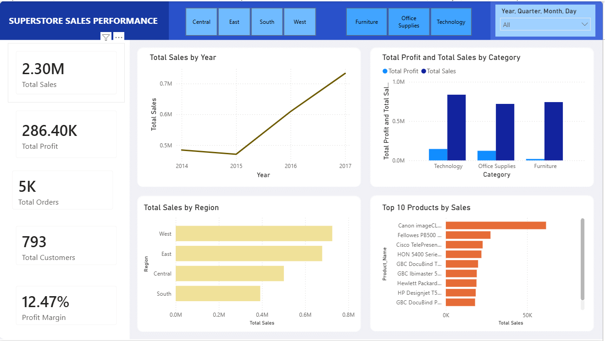

# Superstore Sales Analysis

A data analysis project using SQL Server and Power BI to analyze sales performance, profitability, customers, products, and regional performance.

---

## Project Overview

This project analyzes sales data from the Superstore dataset.

The main objectives of this project are:

- Analyze sales and profit performance.
- Identify top-performing products and customers.
- Compare sales performance across regions.
- Analyze revenue trends over time.
- Identify loss-making products.
- Segment customers based on revenue.
- Create an interactive Power BI dashboard.

---

## Dataset

The dataset contains retail sales transaction data, including:

- Order information
- Customer information
- Product information
- Sales and profit
- Quantity and discount
- Region and location
- Order and shipping dates

The dataset contains approximately 10,000 sales records.

---

## Tools & Technologies

- SQL Server
- Power BI
- Excel
- GitHub

---

## Data Analysis Process

The project followed these steps:

1. Import the dataset into SQL Server.
2. Check data quality and missing values.
3. Explore the dataset using SQL.
4. Perform business analysis.
5. Apply advanced SQL techniques.
6. Create an interactive Power BI dashboard.
7. Extract business insights from the analysis.

---

## SQL Analysis

### 1. Data Quality Checks

The following data quality checks were performed:

- Count total records.
- Preview sample records.
- Check missing values.
- Check duplicate records.

---

### 2. Exploratory Data Analysis

The exploratory analysis included:

- Total number of orders.
- Total number of customers.
- Total sales.
- Total profit.
- Average sales value.

---

### 3. Business Analysis

The following business questions were analyzed:

- How does revenue change over time?
- Which region generates the highest revenue?
- Which category generates the highest sales and profit?
- Who are the top 10 customers by revenue?
- Which products generate the highest revenue?
- Which products generate the highest losses?
- Which category has the highest profit margin?
- Which customers place the most orders?

---

## Advanced SQL Analysis

Advanced SQL techniques were used to answer more complex business questions.

### Window Functions

- `LAG()` was used to compare monthly revenue with the previous month.
- `RANK()` was used to rank products within each category.
- `ROW_NUMBER()` was used to identify the top product in each region.
- `NTILE()` was used to segment customers based on revenue.
- Running totals were used to analyze cumulative revenue.
- Moving averages were used to analyze revenue trends.

---

## Power BI Dashboard

The Power BI dashboard provides an overview of sales and profitability performance.

### Key Performance Indicators

- Total Sales
- Total Profit
- Total Orders
- Total Customers
- Profit Margin
- Average Order Value

### Dashboard Features

- Revenue trend by year.
- Sales performance by region.
- Sales and profit analysis by category.
- Top 10 products by sales.
- Interactive filters for year, region, and category.

---

## Dashboard Preview



---

## Key Insights

Based on the analysis, several business insights were identified:

- The West region generated the highest sales among all regions.
- Technology was one of the strongest-performing categories in terms of sales and profit.
- Revenue showed an overall increasing trend over the analyzed period.
- Some products generated high sales but negative profit.
- A small group of customers contributed significantly to total revenue.
- Customer segmentation can help businesses develop more targeted marketing strategies.

---

## Project Structure

```text
Superstore-Sales-Analysis/
│
├── SQL/
│   ├── 01_Data_Check.sql
│   ├── 02_EDA.sql
│   ├── 03_Business_Analysis.sql
│   └── 04_Advanced_SQL.sql
│
├── Dashboard/
│   └── Superstore_Sales_Analysis.pbix
│
├── Images/
│   └── dashboard.png
│ 
├── Dataset/
│   └── Sample - Superstore.csv
│
└── README.md